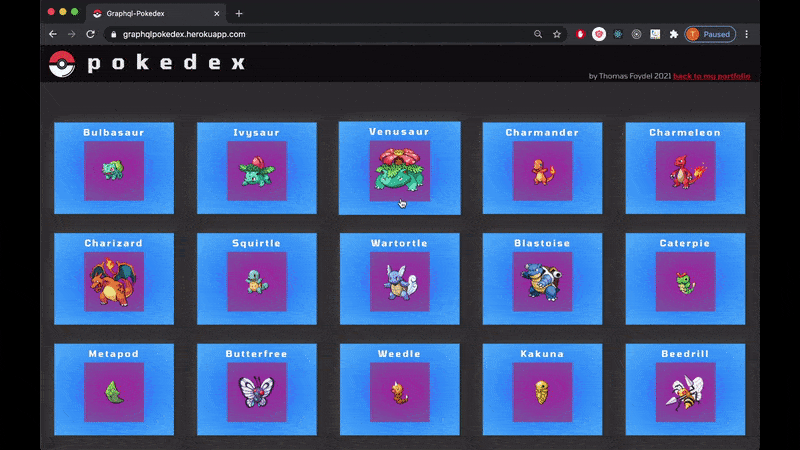

<h1 align='center'>GRAPHQL POKEDEX</h1>
<h2 align='center'>Table of Contents</2>

<a href='#description'>Description</a>

<a href='#installation'>Installation</a>

<a href='#usage'>Usage</a>

<a href='#license'>License</a>

<a href='#questions'>Questions</a>

<a href='https://graphqlpokedex.herokuapp.com/'><h2 align='center'>Live App</h2></a>

<h2>Description</h2>

A pokedex application built in MERN stack with apollo graphql for communication between front-end and back-end, and react-spirng animations.

A year ago I made a MERN app that queried a cool graphql server by Lucas Bento -however- Lucas Bento's project is no longer running, which left my project without a server to query.

So I built a new server and graphql API to serve up the same pokemon JSON data that Bento's server was using, and revamped my react front-end.

This project can be found deployed <a href='https://graphqlpokedex.herokuapp.com/'>here</a>

The code for this project can be found <a href='https://github.com/ThomasFoydel/graphqlPokemon'>here</a>

The code for my old project can be found <a href="https://github.com/ThomasFoydel/oldpokedex">here</a>

The code for the graphql server by Lucas Bento that inspired these projects can be found <a href="https://github.com/lucasbento/graphql-pokemon">here</a>

<h2>Installation</h2>

Download the repo and from the root folder of the project run the command
 
    npm run install-all

<h2>Usage</h2>

To run it locally, from the root folder of the project, run the command

    npm run dev

This will run the front end on <a href='http://localhost:3000'>http://localhost:3000</a>

And the graphql playground can be accessed at <a href='http://localhost:4000/graphql'>http://localhost:4000/graphql</a>

<h2>License</h2>

</img>

<h2>Questions</h2>

Any questions on this or other projects can be directed to thomasjfoydel@gmail.com 

<h2>More Of My Projects</h2>

Thanks for checking this out! Find more of my work on <a href='https://github.com/thomasfoydel'>my GitHub</a>

